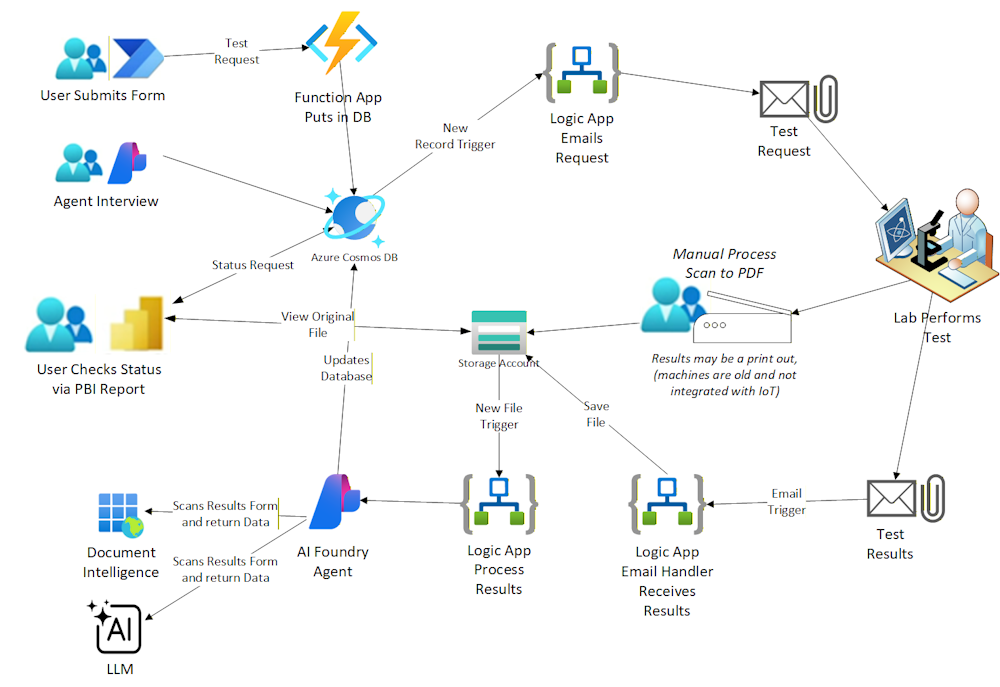

# Lyle's Agentic Logic App Example

This repo is a work in process to create a good example of using agentic logic apps to process documents and extract information from them.

## Introduction

This repository is an example of deploying a .NET 10 Azure Logic apps and Function Apps. The app itself is a very simple process that accepts a request, processes it, then stores the results.

---

## Example Architecture

This process looks something like this:

---

## Concepts Demonstrated

This repository is an example of deploying a .NET 10 Azure Logic apps and Function Apps. The app itself is a very simple process that accepts a request, processes it, then stores the results.

---
This project is intended as a good example of using Infrastructure as Code (IaC) to deploy and manage the Azure resources, utilizing [Bicep](https://learn.microsoft.com/en-us/azure/azure-resource-manager/bicep/overview) to deploy Azure resources declaratively.

The project also has fully automated CI/CD pipelines to deploy both the infrastructure and the application, so you can literally run one pipeline and have it create the Azure Resources, build the program, unit test the program, deploy the program to Azure, and run [Playwright](https://playwright.dev/dotnet/) smoke tests after it is deployed.

The pipelines and actions are all built modularly using templates, so you can snap them into new pipelines or use them in other projects.

---

Deployment Options include:

* [Deploy using Azure DevOps Pipelines](./.azdo/pipelines/readme.md)
* [Deploy using GitHub Actions](./.github/workflows-readme.md)
* [Deploy using AZD Command Line Tool](./.azure/readme.md)

---

[][1]

[1]: https://vscode.dev/github/lluppesms/dadabase.net8.web/

---

License: [MIT](./LICENSE)

<!-- [A good example of a DadJoke API](https://icanhazdadjoke.com/api) -->
